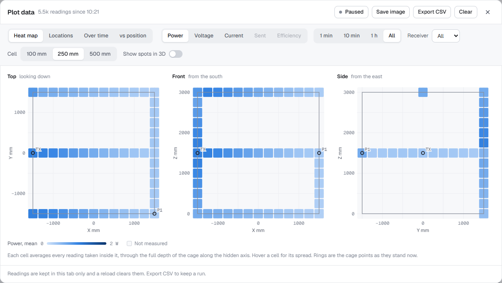

# Cage Power Map

Delivered power shown against position, on two separate test rigs: the 3 m **cage**
and the PMI **flyway**. Saguaro receiver boards report what they receive; the tool
shows it live in 3D, records every reading with where it was taken, and plots it
(heat map, per-location table, over time, against distance).

- Spec: [Graph Automation Feature](https://awle.atlassian.net/wiki/spaces/~712020668dad7d79b94b1991606ab1a9931a0c/pages/1625128980/Graph+Automation+Feature) (Confluence)
- User manual (French): [Manuel d'utilisateur - Internal Data Tool](https://awle.atlassian.net/wiki/spaces/BK/pages/1658978305/Manuel+d+utilisateur+-+Internal+Data+Tool)
- Handing over or picking this up: read [HANDOVER.md](HANDOVER.md) first.

## Quick start

```powershell
py -3.12 -m venv .venv
.\.venv\Scripts\python.exe -m pip install -r requirements.txt     # see the note on pmclib inside
.\.venv\Scripts\python.exe bridge\pmc_bridge.py                    # PMC at 192.168.17.150
```

Then open **<http://localhost:8765>**. The bridge serves the page; there is no build
step and nothing else to install. The page needs the bridge (it is an ES-module app,
so opening `web/index.html` from disk does not work).

```powershell
.\.venv\Scripts\python.exe bridge\pmc_bridge.py --ip auto          # search the network for the PMC
.\.venv\Scripts\python.exe bridge\pmc_bridge.py --mock             # fake movers, no hardware
.\.venv\Scripts\python.exe bridge\fake_saguaro.py                  # fake receiver boards (another terminal)
```

Run one bridge at a time: on Windows a second one can also bind 8765 and requests may
reach the old one. For experiments, give it its own `--port` and `--receivers-file`.

## How it fits together

```
 Saguaro boards ──TCP/protobuf──┐
  (multicast announce)          │
                                ▼
 PMC (pmclib) ──────────► bridge/pmc_bridge.py ──SSE /events──► web/ (browser)
                          read-only, stdlib      ◄──POST /api──  points, assignments
                                │
                     receivers.json, cage_points.json
```

- **The bridge** polls the PMC at 20 Hz (poses, tracking error) and 2 Hz (flyway power,
  temperatures, force), keeps a session with every assigned Saguaro board, and pushes
  everything to the page as Server-Sent Events. It never gains mastership or moves
  anything unless started with `--gain-mastership`.
- **The page** keeps one `state` object that the event stream fills, and draws it:
  three.js for the 3D views, plain DOM for the panels, SVG strings for the plots.

### Code map

| Path | What |
|---|---|
| `bridge/pmc_bridge.py` | Entry point: arguments, the PMC poll loop, the receivers feed, the HTTP server. Its docstring documents the event wire format. |
| `bridge/pmc_sources.py` | Where poses come from: `PmcSource` (pmclib) and `MockSource`. Layout parsing, reference-skew correction. |
| `bridge/http_api.py` | Routes (listed in its docstring), request validation, static files from `web/`, the SSE stream. |
| `bridge/events.py` | `EventHub`: the latest of each event, handed to every connected browser. |
| `bridge/saguaro.py` | Board sessions (Fennec2's state machine), `ReceiverHub` (discovery, assignments, endpoint guessing), `CagePoints`. |
| `bridge/saguaro_protocol.py` | The wire format: announces, framing, a hand-written proto3 codec. |
| `bridge/fake_saguaro.py` | Fake boards speaking the real protocol over real sockets. |
| `web/index.html`, `web/styles.css` | Markup and styles. |
| `web/js/main.js` | Entry point: wires the bridge to the views, switches rigs, runs the frame loop. |
| `web/js/config.js`, `theme.js`, `settings.js`, `labels.js` | Constants (geometry, timing, colours), the chosen colours, the View options, display labels. |
| `web/js/state.js`, `bridge.js` | The page's state and the bridge client that fills it. |
| `web/js/scene.js`, `cage-geometry.js`, `cage-view.js`, `flyway-view.js`, `pointer.js` | The 3D views and mouse/touch handling. |
| `web/js/*-panel.js`, `header.js`, `trends.js` | The side panels, the readings strip and badge, the sparklines. |
| `web/js/recorder.js`, `plot-*.js` | Recording, CSV export, the Plot data dialog and its PNG export. |
| `tools/capture_docs.py` | Regenerates the screenshots in `docs/images/` against a mock rig. |
| `tests/` | Bridge tests (stdlib `unittest`). |
| `docs/` | Cage geometry and bar naming; PMC library findings. |

Every module starts with a one-line comment saying what it owns. Dependencies point
downwards: `config`/`util`/`state` know nothing about views, the bridge client gets
hooks from `main.js` rather than importing views.

## The two rigs

They are separate setups and the tool keeps them separate: own geometry, own view,
own readings. Switch between them in the header. The Saguaro receivers are shared: a
board rides on an xBot or sits at a cage point, one or the other.

### Cage

A 3 m cube with a 2×2 lattice on every face: 48 bars, each exactly 1.5 m (one span
between two joints). Nothing crosses the working volume. See [docs/CAGE-GEOMETRY.md](docs/CAGE-GEOMETRY.md).
A stand off the south-east corner carries the PSU and the TX electronics.

The view is drawn to scale (one scene unit is one millimetre) on a 250 mm floor grid,
with rulers along X (south side), Y (west side) and Z (north-west post).

- **Points** are the positions receivers are measured at. Origin at the centre of the
  cage floor; X west → east, Y south → north, Z up, in mm (the axes marked on the real
  cage, BK-397). **Add** makes one at the cage centre (0, 0, 1500) ready to type in.
  Select a point to edit it, click any bar to put it there (snapped to 10 mm; a
  see-through ball shows where while hovering), or drag it along the bars. The editor
  says which bar a point is on and how far from its zero end, to check with a tape.
  Kept by the bridge in `bridge/cage_points.json`.
- **Receivers** are assigned to a point from the point's editor or the board's
  *At point* select. The point takes the power-scale colour of its reading.

### Flyway

The stator the PMC is configured with (the bench is 4 × 1 S3 flyways, 240 mm) and every
xBot it reports, with pose, lift, tracking error and, for a board riding on it
(*Rides on*), the received power.

- **Layout from the PMC:** `save_pmc_config_xml_file`, read once per connection. The XML
  carries no size, so tiles are taken as 240 × 240 mm and movers by type (M3-06 is
  120 × 120 × 10 mm).
- **Telemetry, 2 Hz:** per flyway power draw and CPU / amplifier / motor temperature;
  per xBot force (Fz shown as lift and implied mass). An empty flyway idles near 11 W;
  the one carrying a mover draws about 80 W more.
- **Tracking error, 20 Hz:** position minus reference, in µm. The two reads are a few ms
  apart, so the bridge shifts the reference back to the position's sample time using
  the reference's own velocity. A couple of µm at rest is the noise floor.
- **PMC coordinates:** origin at the outer corner of flyway 1, as the PMC reports them.

## Plot data

**Plot data** in the header records every reading with the position it was taken at,
while a receiver streams at a cage point or on an xBot (5 Hz: time, x/y/z, W, V, A, and
stator W on the flyway), and plots it, filtered by reading, time range and receiver:

- **Heat map:** the cage from the top, front and side (the flyway from the top), each
  cell the mean of the readings inside it. *Show spots in 3D* colours every measured
  spot in the 3D view.
- **Locations:** one sortable row per spot (10 mm) per receiver.
- **Over time:** a line per receiver; the crosshair names the point each reading came from.
- **vs position:** each spot's mean against distance from a chosen point (add the TX as
  a point) or against X, Y or Z.

**Save image** saves the graph on screen as a PNG (2×, titled with rig, view, reading and
time), ready for a test report. **Export CSV** writes `time, receiver, mac, rig, place,
x_mm, y_mm, z_mm, power_W, voltage_V, current_A, stator_W`, one row per reading.

 Recordings live in the browser
tab: export before reloading.

## Receivers (Saguaro)

The bridge finds and reads boards the way Fennec2 does (protocol from Fennec2 v1.7.1
`Devices/MCU/McuDevice.cs` and `Communication/protobuf/fennec2.proto`):

- **Detect.** Boards multicast `<port>-SAGUARO-<MAC>` to `224.0.0.251:4210` about once a
  second. A board is listed while it has announced in the last 3.5 s or is streaming.
- **Connect.** TCP, then `fennec2` → name and firmware, `ep-man list` → endpoints,
  `print protobuf` + `s 1` → telemetry, `ping` keep-alive, reconnect after 4 s of
  silence. Only boards you connect or assign are opened, so the bridge won't take a
  board Fennec2 is using (a board accepts one client).
- **Assign.** *At point* (Cage) or *Rides on* (Flyway); setting one clears the other.
  *Power / Voltage / Current from* pick the endpoints for W, V and A, guessed on first
  contact from the unit each endpoint reports or names like `P_out`, and switched on
  with `ep-man index` if needed. Saved by MAC in `bridge/receivers.json`; assigned
  boards reconnect by themselves after a restart.

Fake boards (`bridge\fake_saguaro.py`) use MACs `02:00:00:5A:67:xx`, a locally
administered range no real board uses. Board 2 starts with its power endpoint off, to
exercise `ep-man index`.

## View options

**View** in the header: which sections and 3D details are shown, and the colours
(accent, power scale, xBot finish, 3D background). Saved per browser in
`localStorage`; the page works the same if storage is blocked. The power scales are
single-hue; blue is the dataviz reference ramp, the others keep its lightness and
chroma step for step.

## Development

```powershell
.\.venv\Scripts\python.exe -m unittest discover -s tests -v
```

The suite covers the protocol codec, cage points, the receiver hub (placement rules,
endpoint guessing, reachability, stale readings), the PMC/mock sources, and the HTTP
routes against a real server on a random port, including that nothing outside `web/`
is served. It never binds 8765, never touches the network beyond localhost, and keeps
its files in a temp folder.

There is no automated test for the page. To check a front-end change, run the bridge
with `--mock` and `fake_saguaro.py` on a spare `--port` with its own
`--receivers-file`, then go through both rigs, every panel and every Plot data tab
with the browser console open.

`tools\capture_docs.py` does most of that by itself: it starts its own mock rig, drives
headless Edge through both rigs, the View panel, every Plot data tab and Save image,
reports any page errors, and rewrites the screenshots in `docs/images/`. The cage plots
in those screenshots come from a simulated mapping run.

Conventions:

- **Bridge:** standard library only (plus `pmclib` for the real PMC). Shared state
  between threads is guarded by the owning object's lock.
- **Page:** no build, no framework, no npm. ES modules, three.js r128 from cdnjs.
  Module-level bindings are `const` unless reassigned; function bodies use the
  original ES5 style (`var`, `function`). Keep one concern per module, and add a
  header comment to new ones.
- **Units:** mm and degrees on the wire and in the page; the PMC's metres and
  radians are converted in `pmc_sources.py` only.

## Known gaps

- The grey equipment box inside the cage in the CAD screenshot is not modelled; unclear
  what it is.
- The CAD shows a beam passing through the cage and out the far side. If that is a rail
  the TX travels along rather than a fixed mount, the cage becomes a second sweep rig
  and this tool needs rethinking on that side.
- Cage dimensions are constants: `BAR_LEN` (1500 mm, one bar) in `web/js/config.js`,
  with the cage two bars a side.
- The cage's TX doesn't report its output, so *Sent* and *Efficiency* plots are Flyway
  only, from stator power (which also includes levitation and motion).
- Recorded readings live in the browser tab only (see Plot data).
